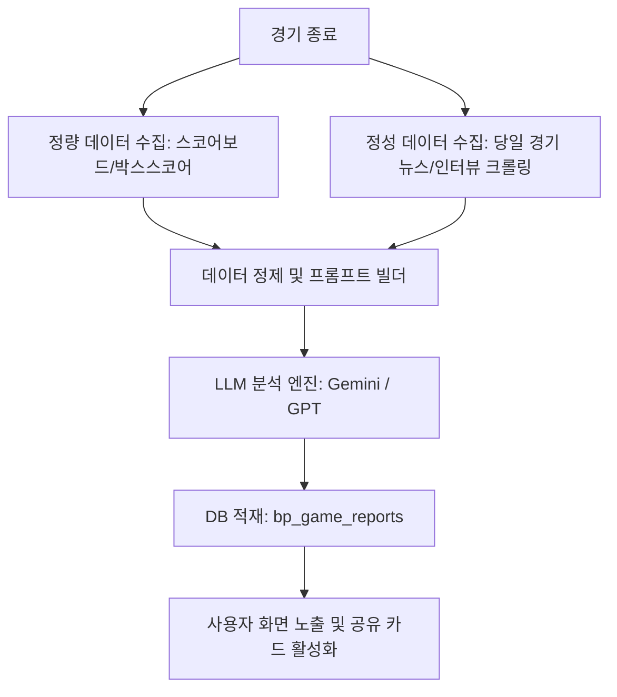
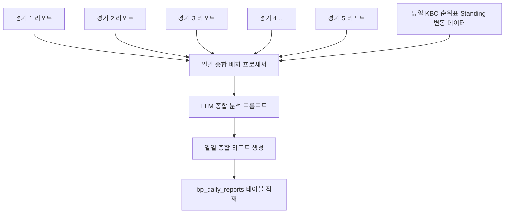

# [기획서] KBO 경기 종료 후 AI 분석 리포트 (경기 리포트 & 승패 요인 분석)

> 작성일: 2026-06-09  
> 작성자: Antigravity (gemini)  
> 대상: KBO 당일 경기 종료 후 사후 분석 콘텐츠  
> 상태: 초안 (기획 리뷰 및 피드백용)  

---

## 1. 개요 및 목적

* **목적**: 경기가 종료된 후, 경기 데이터(스코어보드, 개인 스탯)와 경기 뉴스(기사 헤드라인, 인터뷰, 총평)를 결합하여 **팬들의 공감을 이끌어내는 고품질의 경기 리포트 및 승패 요인 분석**을 자동 생성합니다.
* **배경**: 팬들은 경기 종료 후 "왜 졌는지", "누구 덕에 이겼는지"를 복기하고 토론하는 것을 좋아합니다. 단순한 스탯 나열을 넘어 **서사(Narrative)와 핵심 포인트가 담긴 분석 콘텐츠**를 제공하여 유저의 앱 체류 시간(Retention)과 커뮤니티 활성화를 극대화합니다.
* **차별점**: 경기 결과 수치(정량)에만 의존하지 않고, 경기 직후 쏟아지는 뉴스 기사 및 감독/선수 인터뷰(정성)를 함께 LLM에 주입하여, "몇 회초에 누가 실책을 해서 흐름이 넘어갔는지", "감독의 어떤 작전이 통했는지" 등 실제 경기를 본 듯한 생생한 분석을 만들어냅니다.

---

## 2. 데이터 수집 및 파이프라인 (Data Ingestion)

경기 분석의 신뢰성을 위해 **정량적 팩트(데이터)**와 **정성적 맥락(뉴스/인터뷰)**을 모두 수집합니다.

### 2.1. 정량 데이터 (Source of Truth)
* **KBO 공식 / Statiz 데이터**:
  * 경기 최종 스코어 및 이닝별 스코어 (라인 스코어)
  * 팀별 스탯 (안타, 홈런, 실책, 사사구, 잔루, 득점권 타율 등)
  * 결정적 투구/타격 스탯 (선발 투수의 이닝/투구수/자책점, 결승타 주인공, 홈런 친 선수, 결정적 실책 기록 등)
  * 경기 시간, 관중 수, 구장 날씨 등 환경 데이터

### 2.2. 정성 데이터 (Context & Narrative)
* **네이버 스포츠 / 주요 언론사 뉴스 기사**:
  * 경기 종료 직후 30분~1시간 이내에 포털에 송출되는 경기 종합 기사 3~5개 크롤링
  * 감독의 경기 후 인터뷰 ("오늘 선발 ~ 선수가 위기를 잘 넘겼고...", "~ 상황의 대타 작전이 주효했다")
  * 수훈(MVP) 선수 인터뷰 및 활약상 디테일 기사

---

## 3. 분석 모델 및 LLM 프롬프트 전략

### 3.1. 팩트 가드레일 (Anti-Hallucination)
* **원칙**: LLM이 뉴스 기사의 과장이나 오보에 낚여 가짜 팩트를 작성하지 않도록 제어합니다.
* **방법**: 
  1. **정량 데이터(스코어보드 및 공식 스탯)**를 **`[Hard Facts]`**로 지정하여 최우선 신뢰하도록 강제합니다. (예: "오늘 경기에서 KIA는 실책을 2개 기록함")
  2. 뉴스 기사 텍스트는 **`[Narrative Context]`**로 전달하여, 정량 데이터 사이의 인과관계를 설명하는 힌트로만 사용하게 합니다. (예: "2번째 실책이 7회말 2사 만루 상황에서 나와 실점으로 연결됨")

### 3.2. 분석 출력 템플릿
LLM은 분석 결과를 다음과 같은 구조의 JSON 포맷으로 생성합니다.

1. **경기 총평 (Game Summary)**: 경기의 큰 흐름과 결정적인 승부처를 드라마틱하게 요약한 3~4문장의 단락.
2. **승리 요인 (Winning Factors)**: 승리팀의 2~3가지 핵심 활약 요인.
   * *예시: ① 선발 투수의 위기관리 능력 (6회 무사 만루 탈출), ② 테이블 세터진의 100% 출루 및 도루 흔들기*
3. **패배 요인 (Losing Factors)**: 패배팀의 2~3가지 결정적인 패배 원인.
   * *예시: ① 득점권 찬스에서의 빈타 (잔루 11개), ② 8회초 필승조의 제구 난조와 폭투로 인한 역전 허용*
4. **경기 히어로 (Game Hero)**: 경기 MVP 선수와 그 선수의 오늘 활약 요약.
5. **한 줄 위트 평 (One-liner)**: 야구팬들이 커뮤니티에서 공감하고 웃을 수 있는 재치 있는 한 줄 드립.

### 3.3. API 무료 한도 대응 및 하이브리드 모델 운용 전략
* **Gemini API 무료 한도 (Google AI Studio 기준)**:
  * **Gemini 1.5 / 2.5 Pro**: 분당 2회 (2 RPM), **하루 50~100회 (50~100 RPD)**
  * **Gemini 1.5 / 2.5 Flash**: 분당 15회 (15 RPM), **하루 1,500회 (1,500 RPD)**
* **일일 리포트 호출 설계**:
  * 경기 당일 생성해야 하는 분석은 **개별 경기 리포트 5회 + 일일 종합 리포트 1회 = 총 6회**입니다.
  * 유저가 조회할 때마다 실시간 호출하는 것이 아니라, **서버 백그라운드 배치(Cron)로 하루에 단 한 번(6회 API 호출) 수행하여 DB에 저장**하고 유저들에게는 캐싱된 데이터를 보여주기 때문에 **Pro 모델의 일일 무료 한도 내에서 매우 안정적으로 동작이 가능**합니다.
* **Pro & Flash 하이브리드 전략**:
  * **개별 경기 리포트 (5개)**: 비교적 분석 난이도가 낮은 단일 경기의 요약이므로, 속도가 빠르고 일일 한도가 넉넉한 **Gemini Flash** 모델을 사용해 API 자원을 아낍니다.
  * **일일 종합 리포트 / 주간 리포트 (1개)**: 여러 경기를 취합하고 순위 경쟁 및 트렌드를 유기적으로 분석해야 하는 고난도 작업이므로, 성능이 압도적인 **Gemini Pro** 모델을 사용합니다.
  * 이렇게 구성할 경우 하루에 **Pro 모델 호출은 1회, Flash 모델 호출은 5회**로 극히 최소화되므로 무료 한도 한참 안에서 최상의 퀄리티를 낼 수 있습니다.

---

## 4. 데이터베이스 스키마 설계 (제안)

기존 Supabase DB의 규칙을 따르고, 미니게임/예측 데이터와 격리되도록 `bp_` 접두사를 사용합니다.

### 4.1. `bp_game_reports` (경기 리포트 테이블)

| 컬럼명 | 타입 | 제약 조건 | 설명 |
| :--- | :--- | :--- | :--- |
| `id` | UUID | PRIMARY KEY, default: gen_random_uuid() | 리포트 고유 ID |
| `game_id` | UUID | FOREIGN KEY (`games.id`), UNIQUE | 해당 경기 ID |
| `game_date` | DATE | NOT NULL | 경기 일자 (조회 인덱스용) |
| `summary` | TEXT | NOT NULL | 경기 총평 요약 |
| `winning_factors` | JSONB | NOT NULL | 승리 요인 목록 (제목, 설명, 관련 선수 ID 배열 등) |
| `losing_factors` | JSONB | NOT NULL | 패배 요인 목록 (제목, 설명, 관련 선수 ID 배열 등) |
| `game_hero_id` | VARCHAR | NULL | 경기 MVP 선수 ID (`kbo_players` 연계) |
| `game_hero_comment` | TEXT | NULL | MVP 활약 요약 |
| `one_liner` | VARCHAR(255)| NOT NULL | 야구팬 공감 한 줄 평 |
| `raw_news_summary` | TEXT | NULL | LLM에 주입되었던 뉴스 요약 데이터 (디버깅용) |
| `created_at` | TIMESTAMPTZ | default: now() | 생성 일시 |
| `updated_at` | TIMESTAMPTZ | default: now() | 수정 일시 |

---

## 5. UI/UX 화면 설계 및 레이아웃 기획

어제 경기 결과를 확인하러 들어온 유저에게 **가장 먼저 눈에 띄고, 직관적으로 읽히는 디자인**을 적용합니다.

### 5.1. 진입 경로
* **홈 탭 / '경기 결과' 섹션**: 
  * 경기 결과 스코어보드 하단에 **`[AI 분석 리포트]`** 배지 또는 버튼 배치.
  * 경기 종료 직후 분석이 완료되면 "분석 완료" 불빛(초록색 펄스 애니메이션) 표시.
* **'AI 예측' 탭과 대비되는 사후 콘텐츠**: 
  * "전날 경기 예측 적중 여부"와 "실제 경기 결과 분석"을 한 화면에서 유기적으로 연결.

### 5.2. 분석 리포트 상세 모달/페이지 UI 구성
1. **헤더**:
   * 양 팀 스코어보드 (R-H-E-B 포함)
   * 경기 MVP(Hero) 선수 카드 (선수 배지와 오늘 성적 요약)
2. **본문 (아코디언 및 카드 뷰)**:
   * 📝 **한 눈에 보는 경기 총평**: 깔끔한 폰트와 자간, 옅은 그레이 배경 박스에 담아 가독성 확보.
   * 🟢 **승리의 불꽃 (승리 요인)**: 승리팀 컬러 테두리가 둘러진 카드 형태. 요인별 키워드 태그 제공.
   * 🔴 **패배의 불씨 (패배 요인)**: 패배팀 컬러(또는 경고색인 레드 톤 soft 배경) 카드 형태.
   * 💬 **팬들이 외치는 한 줄**: 커뮤니티 밈(meme)을 반영한 위트 있는 한 줄 평을 큰 폰트로 강조.
3. **공유 액션**:
   * **`[경기 리포트 카드 이미지 저장]`** 및 **`[카카오톡 공유]`** 버튼.
   * 공유 카드 이미지에는 최종 스코어, MVP 선수명, 그리고 'AI 한 줄 평'이 예쁘게 레이아웃되어 들어감.

---

## 6. 구현 태스크 분할 및 스케줄링 (Roadmap)

### 1단계: 스크래퍼 및 데이터 수집기 구현 (1주)
* 경기 종료 감지 트리거 구현 (KBO 공식 API/웹 파싱)
* 경기 종료 30분 후, 포털 스포츠 뉴스 섹션에서 해당 매치업의 뉴스 기사(본문 포함) 자동 스크래핑 스크립트 작성
* 경기 최종 박스스코어 데이터 적제 검증

### 2단계: 분석 엔진 및 프롬프트 튜닝 (1주)
* LLM (Gemini 2.5 Flash / GPT-4o-mini) 연동 분석 프롬프트 엔지니어링
* 야구 전문 용어(예: '볼넷', '삼진', '블론세이브', '득타율') 및 팬들이 쓰는 밈 반영 톤앤매너 튜닝
* 가짜 정보(Hallucination) 방지를 위한 정량 데이터 검증 필터 구현

### 3단계: DB 스키마 생성 및 백엔드 API 구현 (0.5주)
* `bp_game_reports` 테이블 마이그레이션 적용 및 RLS 규칙 설정
* 경기 완료 시점에 배치(Batch)로 분석 데이터를 생성하여 DB에 자동 Insert하는 Cron 작업 설정
* 클라이언트 조회를 위한 API / RPC 함수 구현

### 4단계: 프론트엔드 UI 개발 및 공유 카드 구현 (1.5주)
* 경기 결과 리포트 상세 UI 컴포넌트 개발 (Vanilla CSS + shadcn/ui 패턴 활용)
* 팀 컬러 동적 매핑 및 반응형 레이아웃 구현
* `@vercel/og` 혹은 `html-to-image` 라이브러리를 활용한 경기 리포트 요약 카드 이미지 생성 기능 구현

---

## 7. 기대 효과

1. **사용자 재방문(Retention) 향상**: 
   * 아침 출근길이나 경기 종료 직후, 자기가 응원하는 팀의 분석 보고서를 확인하기 위해 매일 정기적으로 접속하는 유저층 형성.
2. **커뮤니티 바이럴 활성화**:
   * 독특하고 위트 있는 AI 한 줄 평과 경기 분석 카드가 야구 커뮤니티(디시인사이드, 에펨코리아, 야구 톡방 등)에 짤방 형태로 공유되며 자연스러운 신규 유저 유입 유도.
3. **콘텐츠 다양성 확보**:
   * 사전 경기 예측(AI 승리회로 배틀)에 이어 사후 경기 분석(AI 분석 리포트)까지 제공하여, KBO의 시작과 끝을 함께하는 종합 야구 콘텐츠 서비스로 포지셔닝.

---

## 8. 확장 기획: KBO 일일 종합 리포트 (Daily Round-up) 자동화

매일 진행되는 KBO 5경기의 개별 리포트를 기반으로, 당일 KBO 전체 판도를 요약해 주는 **"오늘의 KBO 3분 요약 (일일 종합 리포트)"** 자동 생성 기획입니다.

### 8.1. 일일 종합 리포트 핵심 콘텐츠
1. **오늘의 KBO 3줄 요약 (Headline)**: 출근길 야구팬이 오늘 야구 판도를 30초 만에 파악할 수 있는 핵심 요약.
2. **오늘의 Hot Topic (주요 흐름)**: 
   * 예: "불붙은 엘롯기 동반 승리!", "한화의 감격스러운 5연패 탈출과 선발진 호투"
3. **오늘의 KBO 히어로 (Daily MVP)**: 5경기 수훈 선수 중 가장 압도적인 성적을 거두거나 극적인 상황을 만든 1명의 선수 선정 및 한 줄 평.
4. **순위 판도 변동 브리핑**: 당일 승패에 따른 상위권/중위권/하위권 순위 변동 요약.

### 8.2. 데이터베이스 스키마 (`bp_daily_reports`)

| 컬럼명 | 타입 | 제약 조건 | 설명 |
| :--- | :--- | :--- | :--- |
| `report_date` | DATE | PRIMARY KEY | 리포트 일자 (일자별 단 1개 존재) |
| `headlines` | JSONB | NOT NULL | 오늘의 3줄 요약 (문장 배열) |
| `hot_topics` | JSONB | NOT NULL | 오늘 발생한 주요 사건/흐름 요약 (제목, 설명 등) |
| `daily_mvp_player_id`| VARCHAR | NULL | 오늘의 KBO MVP 선수 ID |
| `daily_mvp_comment` | TEXT | NULL | 오늘의 MVP 선정 이유 및 코멘트 |
| `standings_summary` | TEXT | NOT NULL | 순위 변동 상황 요약 |
| `created_at` | TIMESTAMPTZ | default: now() | 생성 일시 |

### 8.3. 자동화 워크플로우 (Daily Cron)
1. **트리거**: 매일 밤 당일 예정된 5경기가 모두 종료(모두 `status = 'completed'`)된 것을 백엔드 스케줄러가 감지합니다. (보통 22:30 ~ 23:30 KST)
2. **수집**: `bp_game_reports` 테이블에서 당일 생성된 5개의 개별 경기 리포트 요약본과 당일 업데이트된 구단 순위 데이터를 수집합니다.
3. **LLM 생성**: 5개 경기의 승패, 스코어, 각 경기 요약, MVP 정보를 하나의 통합 프롬프트 템플릿에 주입하여 Gemini/GPT로 종합 분석을 요청합니다.
4. **발행**: 생성된 JSON 결과를 `bp_daily_reports`에 저장하고, 아침 07:00 KST에 유저들에게 홈 화면 팝업/배너 또는 알림으로 노출합니다.

